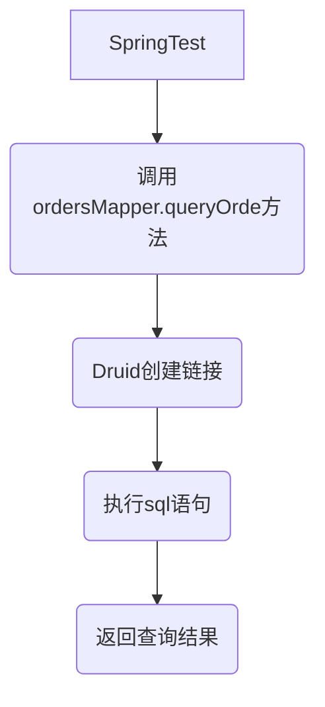

### 1.OrderMapper相关

##### 1.1 查询相关 **queryOrders()**

- 创建pojo： **Order**

  ```java
  package cdu.tuogen.pojo;
  
  
  import java.util.List;
  
  /**
   * @author Breezeluoxi
   */
  public class Order {
  
    private Long orderId;
    private String name;
    private Long merId;
    private Long userId;
    private Long adminId;
    private List<OrderGoods> goodList;
    
    @Override
    public String toString() {
      return "Orders{" +
              "orderId=" + orderId +
              ", name='" + name + '\'' +
              ", merId=" + merId +
              ", userId=" + userId +
              ", adminId=" + adminId +
              '}';
    }
  
    public Order() {
    }
    
    public Order(Long orderId, String name, Long merId, Long userId, Long adminId) {
      this.orderId = orderId;
      this.name = name;
      this.merId = merId;
      this.userId = userId;
      this.adminId = adminId;
    }
  
    public List<OrderGoods> getGoodList() {
      return goodList;
    }
  
    public void setGoodList(List<OrderGoods> goodList) {
      this.goodList = goodList;
    }
  
    public Long getOrderId() {
      return orderId;
    }
  
    public void setOrderId(Long orderId) {
      this.orderId = orderId;
    }
  
    public String getName() {
      return name;
    }
  
    public void setName(String name) {
      this.name = name;
    }
  
    public Long getMerId() {
      return merId;
    }
  
    public void setMerId(Long merId) {
      this.merId = merId;
    }
  
    public Long getUserId() {
      return userId;
    }
  
    public void setUserId(Long userId) {
      this.userId = userId;
    }
  
    public Long getAdminId() {
      return adminId;
    }
  
    public void setAdminId(Long adminId) {
      this.adminId = adminId;
    }
  }
  ```

- 创建**OrderMapper**接口

  

- 编写查询所有order 方法

  ```java
  /**
   * 查询所有订单
   * @return Orders
   */
  List<Order> queryOrders();
  ```

- 实现方法

  ```xml
  <sql id="order_query">
          select order_id as orderId, name,mer_id as merId,user_id as userId,admin_id as adminId
          from orders
  </sql>
  <!-- 1.query userLists -->
  
  <select id="queryOrders" resultType="cdu.tuogen.pojo.Order">
      <include refid="order_query"/>
  </select>
  ```

- 测试流程



