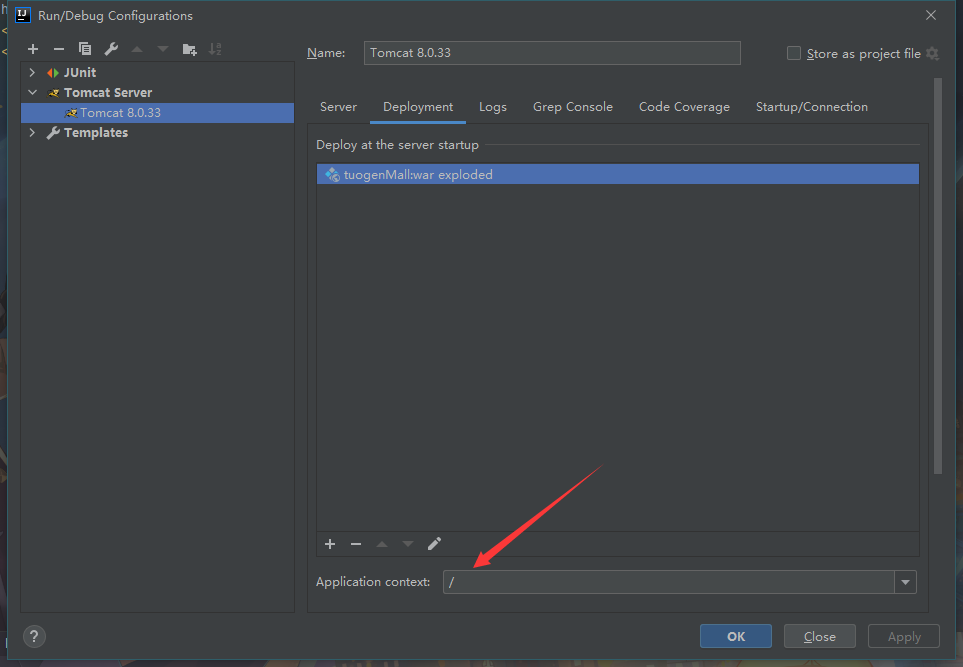

## welecome to tuogenMall
- 1.数据库连接
  - 主机：155.138.134.150
  - 端口：3306  
  - 用户名： Java_frame
  - 密码：
  - 数据库：java
- 2.包类型说明
  - bean view对象包名
  - controller 控制层包名
  - interceptor 过滤器
  - mapper  数据层包名
  - service 服务层（接口规范）
  - service.impl  服务层包名 （实体）
  - util  自定义工具
- 3.文件说明
  - resource:mapper放置所有mapper文件
  - conf 配置文件
  - mybatis mybatis配置文件
  - spring/spring-context.xml spring核心环境
  - spring/spring-mybatis.xml 数据库管理相关以及装配Mapper
  - spring/spring-transaction.xml 数据库管理相关事务提交
  - spring/springmvc.xml springmvc
- 4.webapp相关文件
  - 默认资源路径
  
  - static 静态资源和框架 
  - view 视图层
  